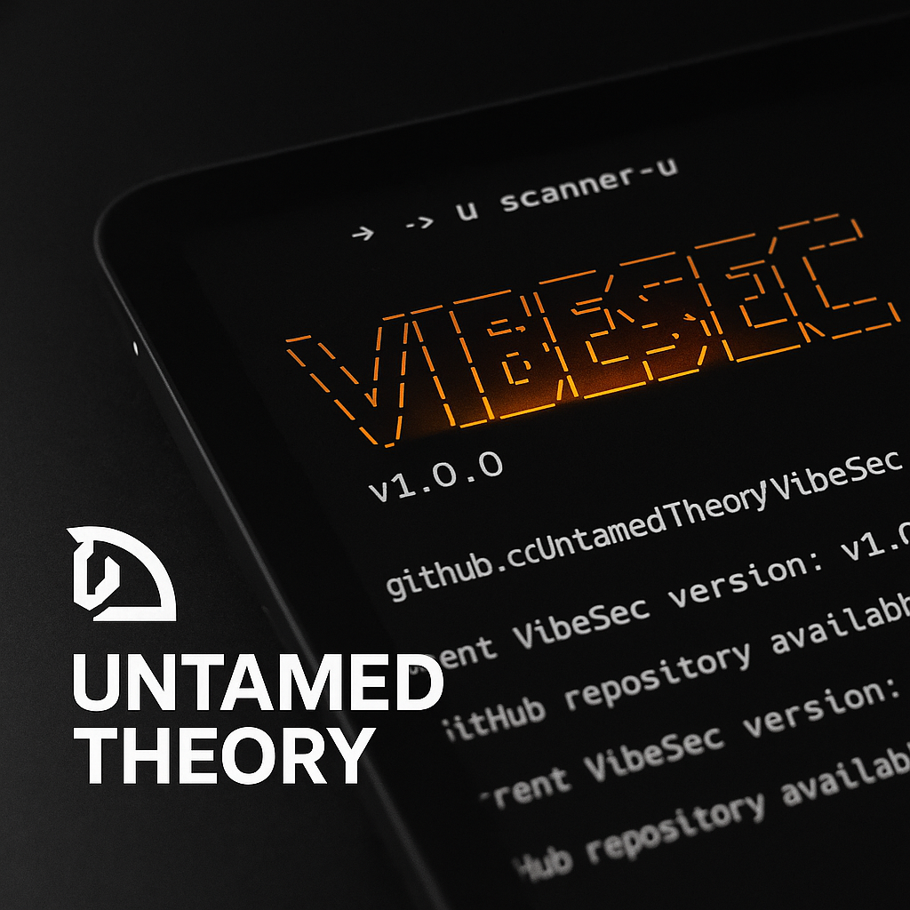
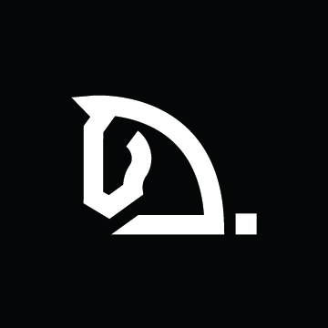

<div align="center">
  
</div>
<br>
<h1 align="center">VibeSec</h1>
<p align="center">
  <strong>Security Rules & Workflows for Cursor and Windsurf AI assistants</strong><br>
  <br>
  <br>
  <a href="https://github.com/untamed-theory/vibesec/issues"></a>
  <a href="https://github.com/untamed-theory/vibesec/stargazers"></a>
  <a href="https://github.com/untamed-theory/vibesec/network"></a>
  <a href="https://github.com/untamed-theory/vibesec/blob/main/LICENSE"></a>
</p>

## Overview

VibeSec is an open-source project created by [Untamed Theory](https://untamed.cloud) that makes the new wave of AI development practices more secure across different AI coding tools. It provides a comprehensive set of security rules for both Windsurf and Cursor AI assistants to help developers write more secure code, following industry best practices.

### What it does:

- Downloads security rules for Windsurf and Cursor development workspaces. Pretty Simple.

### 🛡️ Current Features:

- **Supported AI assistants**: Windsurf and Cursor
- **Industry Standards**: OWASP Top 10 to start (and we'll add more as we go). You can contribute too.
- **Language-specific**: Security hardening techniques for JavaScript, TypeScript, Python, and more
- **Framework-focused**: Targeted security recommendations for popular frameworks like React, Next.js, and Supabase
- **AI-aware**: Special considerations for LLM applications and AI-assisted development. Needs work. Help wanted.

## 🚀 Quick Install

Apply VibeSec to your project with a single command:

```bash
# Auto-detect environment (defaults to Windsurf if detection fails)
curl -sL https://raw.githubusercontent.com/untamed-theory/vibesec/main/scripts/install.sh | bash
```

```bash
# Force Cursor installation
curl -sL https://raw.githubusercontent.com/untamed-theory/vibesec/main/scripts/install.sh | bash -s -- --cursor
```

```bash
# Force Windsurf installation
curl -sL https://raw.githubusercontent.com/untamed-theory/vibesec/main/scripts/install.sh | bash -s -- --windsurf
```

The installation script will automatically detect whether you're using Windsurf or Cursor and install the appropriate rules. If detection fails in a non-interactive environment (like when piped from curl), it will default to Windsurf.

## 🛠️ Cautious Installation

Not feeling lucky? You can always install VibeSec manually. Here's how:

```bash
# From the root of your project
# Clone the repository
git clone https://github.com/untamed-theory/vibesec.git

# Install the rules
./vibesec/scripts/install.sh
```
OR

Copy and paste the rules wherever and however you want. This is America after all.

## ✨ Features

<table>
  <tr>
    <td width="50%">
      <h3>🔄 Unified Security Rules</h3>
      <p>Consistent security guidelines that work seamlessly across both Windsurf and Cursor AI assistants.</p>
    </td>
    <td width="50%">
      <h3>🔌 Easy Integration</h3>
      <p>Get started with a single command installation and zero configuration required.</p>
    </td>
  </tr>
  <tr>
    <td width="50%">
      <h3>📚 Well Documented</h3>
      <p>Clear examples distinguishing secure vs. insecure patterns with practical code snippets.</p>
    </td>
    <td width="50%">
      <h3>🛠️ Community-Driven</h3>
      <p>Continuously updated by security experts and the developer community.</p>
    </td>
  </tr>
</table>

### 📋 Comprehensive Security Categories

- **`frontend`**: CORS configuration, NextJS best practices, Supabase authentication, UI security
- **`backend`**: Rate limiting, API security, server-side validation
- **`database`**: SQL injection prevention, Supabase hardening, data access controls
- **`infrastructure`**: Secrets management, configuration security, deployment safety
- **`ai`**: LLM prompt injection prevention, model security considerations
- **`supply-chain`**: Dependency management, secure package selection, SBOM
- **`general`**: OWASP Top 10, cross-cutting security concerns

## 🗂️ Directory Structure

```
vibesec/
├── definitions/         # Canonical security rule definitions
│   ├── frontend/           # Frontend security rules
│   ├── backend/            # Backend & API security rules
│   ├── database/           # Database security rules
│   ├── infrastructure/     # Infrastructure & DevOps security rules
│   ├── ai/                 # AI & LLM security rules
│   ├── supply-chain/       # Supply chain security rules
│   └── general/            # Cross-cutting security principles
├── rules/               # Built rules for AI assistants
│   ├── windsurf/           # Windsurf-formatted rules (.md)
│   └── cursor/             # Cursor-formatted rules (.mdc)
└── scripts/
    ├── install.sh         # Installation script
    └── build_rules.sh     # Builds rules from definitions
````

## 👥 Contributing

<p align="center">
  <i>We welcome contributions from the community!</i>
</p>

Contributing to VibeSec is easy:

1. Fork the repository
2. Create your feature branch (`git checkout -b feature/amazing-rule`)
3. Create your security rule with these guidelines:
   - All security rules start with the prefix `security-`
   - Create a single canonical rule in the appropriate `definitions/` directory
   - Include clear code examples showing both secure and insecure patterns
   - Run `./scripts/build_rules.sh` to generate Windsurf and Cursor versions
4. Commit your changes (`git commit -m 'Add amazing security rule'`)
5. Push to the branch (`git push origin feature/amazing-rule`)
6. Open a Pull Request

See [CONTRIBUTING.md](CONTRIBUTING.md) for detailed guidelines.

## ⚖️ License

This project is licensed under the terms specified in the [LICENSE](LICENSE) file.

<div align="center">
  <br>
  <a href="https://untamed.cloud">
    
  </a>
  <p><sub>Created with ❤️ by <a href="https://untamed.cloud">Untamed Theory</a></sub></p>
</div>
